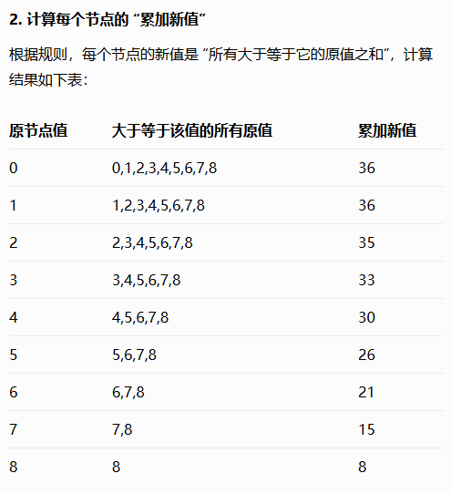

# 二叉树part08

### 669. 修剪二叉搜索树

[题目链接/文章讲解](https://programmercarl.com/0669.%E4%BF%AE%E5%89%AA%E4%BA%8C%E5%8F%89%E6%90%9C%E7%B4%A2%E6%A0%91.html)

~~~c++
class Solution {
public:
    TreeNode* trimBST(TreeNode* root, int low, int high) {
        if(!root) return nullptr;
        if(root->val < low) return trimBST(root->right, low, high);
        if(root->val > high) return trimBST(root->left, low, high);
        root->left = trimBST(root->left, low, high);
        root->right = trimBST(root->right, low, high);
        return root;
    }
};
~~~

简单

### 108.将有序数组转换为二叉搜索树

[题目链接/文章讲解](https://programmercarl.com/0108.%E5%B0%86%E6%9C%89%E5%BA%8F%E6%95%B0%E7%BB%84%E8%BD%AC%E6%8D%A2%E4%B8%BA%E4%BA%8C%E5%8F%89%E6%90%9C%E7%B4%A2%E6%A0%91.html)

构造二叉树还是有点不熟

跟着答案作出

~~~c++
class Solution {
private:
    TreeNode* build(vector<int>& nums, int left, int right) {
        if (left > right) return nullptr;
        int mid = left + (right - left) / 2;
        TreeNode* node = new TreeNode(nums[mid]);
        node->left = build(nums, left, mid - 1);
        node->right = build(nums, mid + 1, right);
        return node;
    }
public:
    TreeNode* sortedArrayToBST(vector<int>& nums) {
        TreeNode* root = build(nums, 0, nums.size() - 1);
        return root;
    }
};
~~~

### 538.把二叉搜索树转换为累加树  

[题目链接/文章讲解](https://programmercarl.com/0538.%E6%8A%8A%E4%BA%8C%E5%8F%89%E6%90%9C%E7%B4%A2%E6%A0%91%E8%BD%AC%E6%8D%A2%E4%B8%BA%E7%B4%AF%E5%8A%A0%E6%A0%91.html)

首先什么是累加树我都不知道

豆包儿这样说，我一下就懂了

也很简单，跟之前的题反过来从大到小遍历就好了

